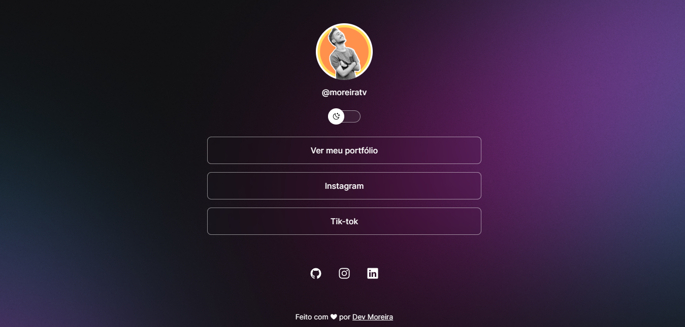

<h1 align="center"> Social Links </h1>

 App web para agrupar seus links para utilizar em biografias de rede sociais. 

  <a href="#-tecnologias">Tecnologias</a>&nbsp;&nbsp;&nbsp;|&nbsp;&nbsp;&nbsp;
  <a href="#-projeto">Projeto</a>&nbsp;&nbsp;&nbsp;|&nbsp;&nbsp;&nbsp;

 

  

## 🚀 Tecnologias

Esse projeto foi desenvolvido com as seguintes tecnologias:

- HTML e CSS
- JavaScript

## 💻 Projeto

O Social Links é um agregador de links para usar como cartão de visitas online.

- [Acesse o projeto finalizado, online](https://moreiratv.github.io/social-links)

---

Feito com ♥ by MoreiraTv :wave: 
